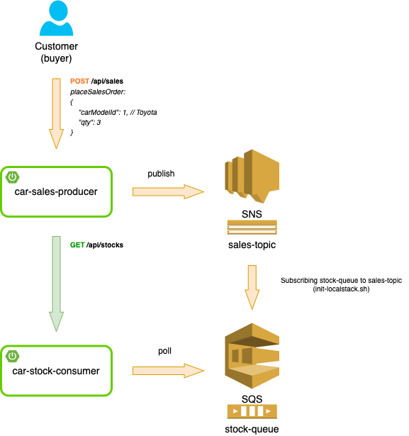

# Car shop

### A semple Spring Boot 3, AWS SNS-SQS application with LocalStack

## App Diagram


## Prerequisites
- [`Java 17+`](https://www.oracle.com/java/technologies/downloads/#java17)
- [`Docker`](https://www.docker.com/)

## Start and initialize LocalStack
Start the LocalStack with docker compose:
```
docker compose -f compose.yml up
```
Initialize LocalStack:
```
./init-localstack.sh
```

## Running the Car Shop app

- Start **car-sales-producer** and **car-stock-consumer** services in your IDE<br>
Pre-configured ports:<br>
**car-sales-producer**:8081<br>
**car-stock-consumer**:8082<br><br>

- Create a REST GET request to populate car stock:
```
curl 'localhost:8082/api/stocks/populate'
```
Now the stock looks like this:<br>

| ID  | Car Model | Quantity |
|-----|:---------:|---------:|
| 1   |  Toyota   |      100 |
| 2   |   Ford    |      100 |
| 3   | Volkswagen  |      100 |

- Create a REST POST request to place a sale order:
```
curl 'localhost:8081/api/sales' --header 'Content-Type: application/json' --data \
'{
    "carModelId": 1,
    "qty": 2
}'
```
In the **car-stock-consumer** log, you should see:
```java
Received Sales Order Event: SalesOrderEvent(carModelId=1, qty=2)
Previous Toyota stock quantity: 100
Actual Toyota stock quantity: 98
```